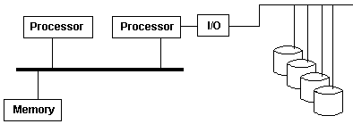
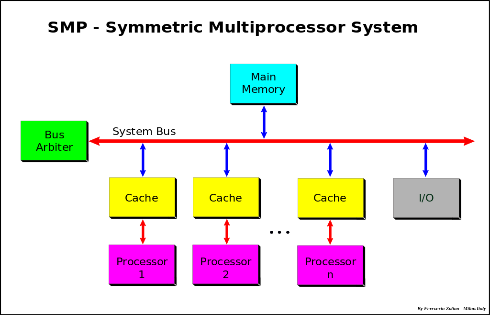

```
## SMP
Symmetric Multiprocessing: All processesors with their caches are connected to single common bus
                           (which is connected all other I/O devices).

Asymmetric Multiprocessing: Specific CPUs perform specific operations
```
```



```
