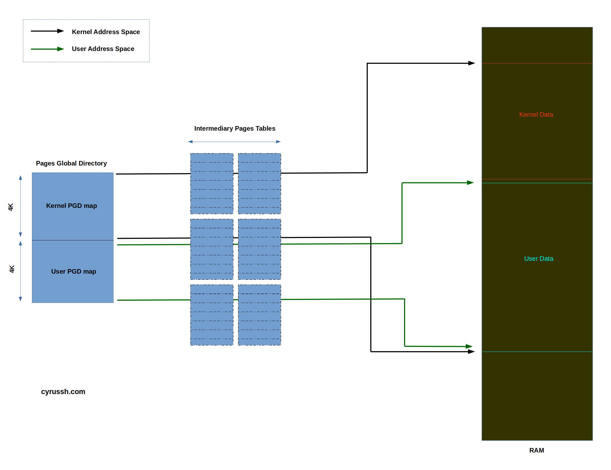

```
Process Context Identifiers (PCID) - 12 bit identifiers of the Translation Lookaside Buffers (TLB) to map
                                     them to which process do they belong to.

PTI - Page Table Isolation

PCID was used in Spectre and Meltdown kind of attacks to only deem the TLB buffers belonging to the present
process as valid ones. When context switch happens, the TLB buffers are not flushed (costly operation, but
were implemented in hardwares that do not have PCID post Spectre and Meltdown). Hence they can try to read
the buffers of another program (could be a kernel space program).
```


